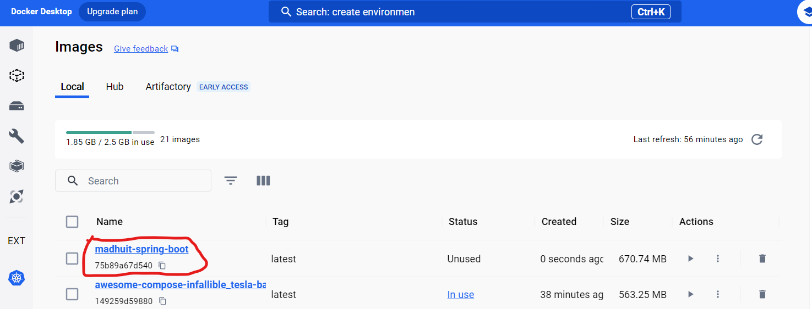
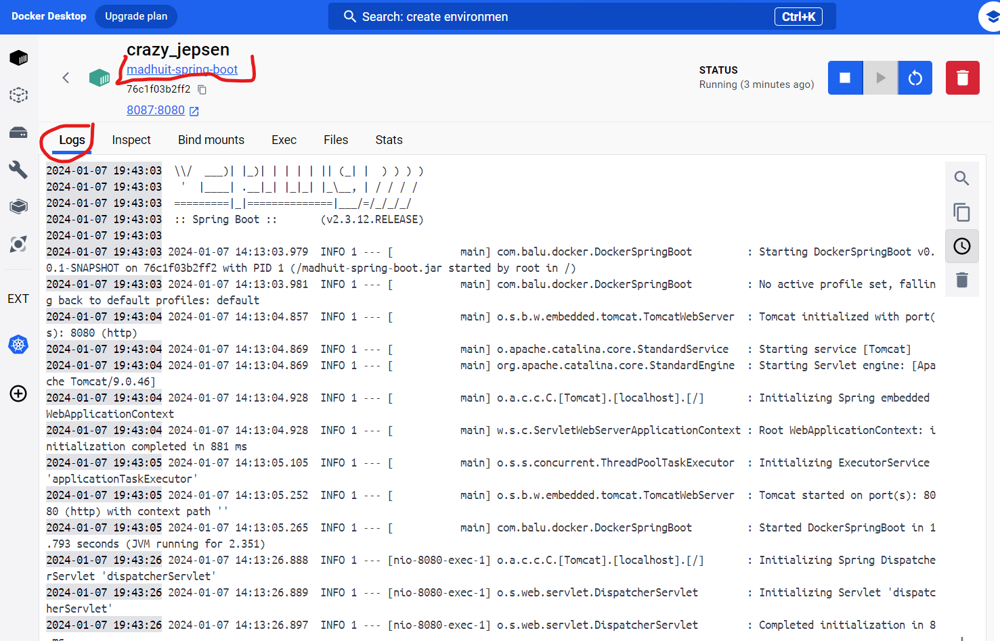

# madhuit-spring-boot
Created Spring Boot - Madhu IT

1. Run mvn clean install to build application

2. Check the Dockerfile whether all commands are valid
    sometimes jar names need to change accordingly.

3. Run Below command for docker build image
C:\Users\Balaji\DockerSetUp\spring-boot\madhuit-spring-boot>docker build -t madhuit-spring-boot:latest .
4. 
5. 

5. Run Below command to run container
C:\Users\Balaji\DockerSetUp\spring-boot\madhuit-spring-boot>docker run -p 8087:8080 madhuit-spring-boot

